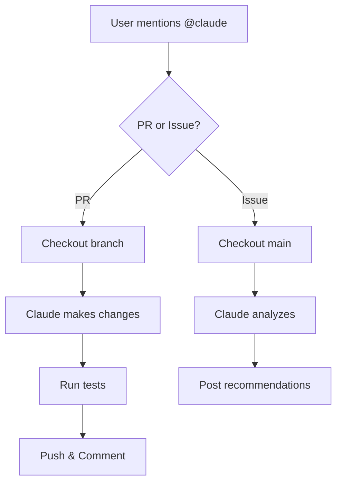

# AI Demo

## Claude Code + GitHub Actions Integration

<div class="pt-12">
  <span class="px-2 py-1 rounded cursor-pointer" hover:bg="white op-10">
    Automating development workflows with AI
  </span>
</div>

---
transition: fade-out
layout: two-cols
layoutClass: gap-16
---

# What is AI Demo?

A demonstration project showing how to integrate **Claude Code CLI** with **GitHub Actions** for automated code assistance.

<v-clicks>

- Trigger Claude via `@claude` mentions
- Automatic code changes on PRs
- Analysis and recommendations on Issues
- Built-in test automation

</v-clicks>

::right::



---
layout: image-right
image: https://images.unsplash.com/photo-1555066931-4365d14bab8c?w=800
---

# Project Structure

```bash
ai-demo/
├── .github/
│   └── workflows/
│       └── claude.yml    # GitHub Action
├── index.js              # Main app
├── index.test.js         # Tests
├── package.json
└── README.md
```

<v-click>

### Simple Greeting App

```js
function greetUser(name) {
  return `Hello, ${name}! Welcome!`;
}

function formatDate(date) {
  return date.toLocaleDateString('en-US', {
    weekday: 'long',
    year: 'numeric',
    month: 'long',
    day: 'numeric'
  });
}
```

</v-click>

---

# GitHub Action Workflow

The magic happens in `.github/workflows/claude.yml`

```yaml {all|1-5|9|17-24|74-76}
name: Claude

on:
  issue_comment:
    types: [created]

jobs:
  claude:
    if: contains(github.event.comment.body, '@claude')
    runs-on: ubuntu-latest
    permissions:
      contents: write
      pull-requests: write
      issues: write

    steps:
      - name: Determine context
        id: context
        run: |
          if [ -n "${{ github.event.issue.pull_request }}" ]; then
            echo "type=pr" >> $GITHUB_OUTPUT
          else
            echo "type=issue" >> $GITHUB_OUTPUT
          fi

      - name: Install Claude Code
        run: npm install -g @anthropic-ai/claude-code
```

---
layout: center
class: text-center
---

# Claude Code CLI

Essential commands for your workflow

---

# Basic Commands

<div class="grid grid-cols-2 gap-8">
<div>

### Getting Started

```bash
# Install globally
npm install -g @anthropic-ai/claude-code

# Start interactive session
claude

# One-shot command
claude "explain this code"

# Print output only (non-interactive)
claude --print "fix the bug"
```

</div>
<div>

### Common Flags

```bash
# Skip permission prompts (CI/CD)
claude --dangerously-skip-permissions

# Continue last conversation
claude --continue

# Resume specific session
claude --resume <session-id>

# Use specific model
claude --model opus
```

</div>
</div>

---

# Slash Commands

Built-in commands for common tasks

| Command | Description |
|---------|-------------|
| `/help` | Show available commands |
| `/clear` | Clear conversation history |
| `/compact` | Condense conversation context |
| `/config` | View/edit configuration |
| `/cost` | Show token usage and costs |
| `/doctor` | Check installation health |
| `/init` | Initialize project with CLAUDE.md |
| `/review` | Review code changes |
| `/pr-comments` | Address PR feedback |

---
layout: two-cols
layoutClass: gap-8
---

# Working with Git

```bash
# Create a commit
claude "commit these changes"

# Create a PR
claude "create a PR for this feature"

# Review current changes
claude /review

# Address PR comments
claude /pr-comments
```

<v-click>

### Best Practices

- Let Claude handle git operations
- Review changes before pushing
- Use `--print` for CI/CD pipelines

</v-click>

::right::

# Project Context

```bash
# Initialize project
claude /init

# Creates CLAUDE.md with:
# - Project overview
# - Build commands
# - Code style guidelines
# - Architecture notes
```

<v-click>

### CLAUDE.md Example

```markdown
# Project: AI Demo

## Commands
- npm test - Run tests
- npm start - Start app

## Style
- Use ES6+ syntax
- Prefer const over let
```

</v-click>

---

# Advanced Usage

<div class="grid grid-cols-2 gap-8">
<div>

### MCP Servers

```bash
# Configure in settings
claude /config

# Add MCP server for:
# - Database access
# - API integrations
# - Custom tools
```

### Hooks

```bash
# Pre/post command hooks
# Configure in .claude/hooks.json

# Example: Auto-format on save
# Example: Run tests after edit
```

</div>
<div>

### Environment Variables

```bash
# API Key
export ANTHROPIC_API_KEY=sk-...

# Custom config location
export CLAUDE_CONFIG_DIR=~/.claude

# Disable telemetry
export CLAUDE_CODE_DISABLE_TELEMETRY=1
```

### Output Formats

```bash
# JSON output
claude --output-format json

# Stream to file
claude --print "query" > output.txt
```

</div>
</div>

---
layout: center
---

# Demo: Using @claude in GitHub

<div class="grid grid-cols-2 gap-12 mt-8">

<div class="text-left">

### On a Pull Request

```markdown
@claude please add input validation
to the greetUser function
```

Claude will:
1. Analyze the request
2. Modify the code
3. Add/update tests
4. Commit changes
5. Push to branch

</div>

<div class="text-left">

### On an Issue

```markdown
@claude how can we improve
the date formatting?
```

Claude will:
1. Analyze the codebase
2. Provide recommendations
3. Suggest implementation
4. *(No code changes)*

</div>

</div>

---

# Key Takeaways

<v-clicks>

1. **Claude Code CLI** - Powerful AI assistant in your terminal
2. **GitHub Actions Integration** - Automate code reviews and changes
3. **@claude Mentions** - Natural language interface for development
4. **PR vs Issue** - Different behaviors for different contexts
5. **Built-in Commands** - `/init`, `/review`, `/commit` and more

</v-clicks>

<div v-click class="mt-12 text-center">

### Resources

[Claude Code Docs](https://docs.anthropic.com/claude-code) | [GitHub Actions](https://github.com/features/actions) | [This Repo](https://github.com/igortas/ai-demo)

</div>

---
layout: center
class: text-center
---

# Questions?

<div class="text-6xl mt-8">
  🤖
</div>

<div class="mt-8 text-gray-400">
  Built with Slidev + Claude Code
</div>
